# Simple NKP Installation Guide on a Nutanix Cluster

- This is a simple installation guide for Nutanix Kubernetes Platform v2.17 on AHV VMs using a Linux/macOS machine.

## Table of Contents
- [Prerequisites](#prerequisites)
- [Setting up a Subnet in Prism Central](#setting-up-a-subnet-in-prism-central)
- [Creating a Storage Container in Prism Central](#creating-a-storage-container-in-prism-central)
- [Configuring Prism Central Authorization Policy and Role](#configuring-prism-central-authorization-policy-and-role)
- [Adding a Base Image for use with NKP](#adding-a-base-image-for-use-with-nkp)
- [Deploying an NKP Cluster](#deploying-an-nkp-cluster)
- [(Optional) Adding Harbor Container Registry to the Cluster](#optional-adding-harbor-container-registry-to-the-cluster)
    - [Deploying CloudNativePG](#deploying-cloudnativepg)
    - [Adding Nutanix Object Store](#adding-nutanix-object-store)
    - [Enabling CloudNativePG with your Cluster](#enabling-cloudnativepg-with-your-cluster)
- [Using Harbor as the Cluster's Pull-Through Cache](#using-harbor-as-the-clusters-pull-through-cache)
- [Installing Kyverno for use with Harbor as a Pull-through Cache](#installing-kyverno-for-use-with-harbor-as-a-pull-through-cache)

---

## Prerequisites
- Download the Nutanix Kubernetes Platform (NKP) CLI/binary and Konvoy Image Builder (KIB) from the Nutanix Portal [here](https://portal.nutanix.com/page/downloads?product=nkp). Choose your appropriate OS and version.
  - **Important**: Ensure the NKP CLI version and any KIB image version you use are compatible with each other and with your target Kubernetes version. Mismatched versions are a common source of deployment failures.
  - **Note**: Make sure the appropriate Linux OS image maps to the NKP CLI version.
- `kubectl` installed and available in your `PATH`. Download it [here](https://kubernetes.io/docs/tasks/tools/).
- `helm` (v3+) installed for the optional Harbor/CNPG sections.
- A container engine such as Docker or Podman.
  - Docker Desktop is not permitted in many enterprise environments. Alternatives include Podman, containerd, or Rancher Desktop.
  - On arm64 macOS, Rancher Desktop with `QEMU` emulation and `dockerd` as the container runtime has been validated.
  - The container runtime engine (CRE) allows your laptop to act as a bastion host for a KinD (Kubernetes in Docker) bootstrap cluster, which is used transiently during NKP deployment.
  - For convenience, add the `nkp` binary (and your container CLI) to your `PATH` environment variable rather than referencing its full path each time.
- (Optional) A container registry for your environment.
  - For air-gapped deployments, your bastion host must be able to push air-gapped bundles to an external registry such as Harbor.
- A valid Nutanix account with Prism Central administrator access, specifically for:
    - Managing the cluster (listing subnets, creating VMs).
    - Managing persistent storage used by the Nutanix Container Storage Interface (CSI) provider.
    - Discovering node metadata used by the Nutanix Cloud Controller Manager (CCM).
- A subnet with at least **9 unused IP addresses**:
    - One IP address per Kubernetes node. The default cluster size is **3 control plane nodes** and **4 worker nodes** = **7 IPs**.
    - **1** IP address for the control plane endpoint Virtual IP (VIP).
    - **1** IP address for the NKP MetalLB LoadBalancer service VIP.
    - Both VIPs must fall **outside** the configured DHCP/IPAM pool to avoid conflicts.
- Since this deploys a self-managed NKP cluster, your `KUBECONFIG` must **not** point to an existing cluster during deployment. Before starting:
  ```sh
  # Back up your existing kubeconfig and unset the env variable
  cp ~/.kube/config ~/.kube/config.bak
  unset KUBECONFIG
  # Or move/remove ~/.kube/config entirely for the duration of the deployment
  ```

---

## Setting up a Subnet in Prism Central
> **Note**: A subnet with DHCP/Nutanix IPAM enabled and an IP pool is strongly recommended. These IPs are used to provision NKP Node VMs. Deploying baremetal/pre-provisioned VMs with static IPs is possible but not advised for standard deployments.

1. In Prism Central, open the top drop-down and select **Network & Security**.
2. Click **Subnets**, then **Create Subnet**.
3. Fill out the following fields:
    - **Name**: A descriptive name for the subnet.
    - **Type**: Select `VLAN`.
    - **Cluster**: Select the appropriate Prism Element cluster.
    - **IP Address Management > IP Assignment Service**: Select `Nutanix IPAM`.
    - **Network IP Address / Prefix**: Provide a valid CIDR network address (e.g., `10.x.x.0/24`).
    - **IP Pools**: Provide a `Start Address` and `End Address` that fall within the subnet. This range is the DHCP pool that will be assigned to VMs.
    - **Gateway IP Address**: Must fall within the defined network CIDR.
4. Click **Create**.

---

## Creating a Storage Container in Prism Central
- A dedicated Storage Container is required for use with the Nutanix CSI driver.
- In Prism Central under **Infrastructure**, select **Storage** > **Storage Containers**.
- Click **Create Storage Container** and provide a name. Leave other settings at their defaults unless you have specific requirements.
- **Capacity planning guidance**:
    - Allocate approximately **100 GiB** per node (matching the `--control-plane-disk-gib` / `--worker-disk-gib` defaults used during cluster creation).
    - NKP platform services (Prometheus, Loki, etc.) typically require an additional **120 GiB** of storage capacity.
    - Size accordingly if your workloads have additional persistent storage requirements.
- Note the container name — you will need it during cluster creation.

---

## Configuring Prism Central Authorization Policy and Role
1. In Prism Central, navigate to **Admin Center** > **IAM**.
2. Click **Identities** > **Add Local User** and fill in the appropriate details.
3. Navigate to **Authorization Policies** and click **Create Authorization Policy**.
4. Assign the policy the correct **Role** with the permissions required by NKP. The full and authoritative list of required permissions for NKP v2.17 is documented [here](https://portal.nutanix.com/page/documents/details?targetId=Nutanix-Kubernetes-Platform-v2_17%3Atop-prism-central-role-permissions-r.html).
    - At minimum, the account needs permissions to manage VMs (CAPX), manage Persistent Volumes (CSI), and read node metadata (CCM). It is best practice to create **separate** service accounts for each role (CAPX, CSI, CCM) rather than one shared admin account.

---

## Adding a Base Image for use with NKP
- NKP requires a compatible OS node image to provision VMs.
- For the **NKP Starter license tier**, only the pre-built images distributed with NKP are supported. Higher tiers (Pro, Ultimate) support additional OS images and custom KIB-built images.
- Download the **Rocky Linux 9.6** node image from the Nutanix Portal [here](https://portal.nutanix.com/page/downloads?product=nkp). The filename follows the pattern `nkp-rocky-9.6-<version>.qcow2`.
- In Prism Central, under **Infrastructure**, click **Compute** > **Images**.
- Click **Add Image** and upload the Rocky Linux 9.6 image.

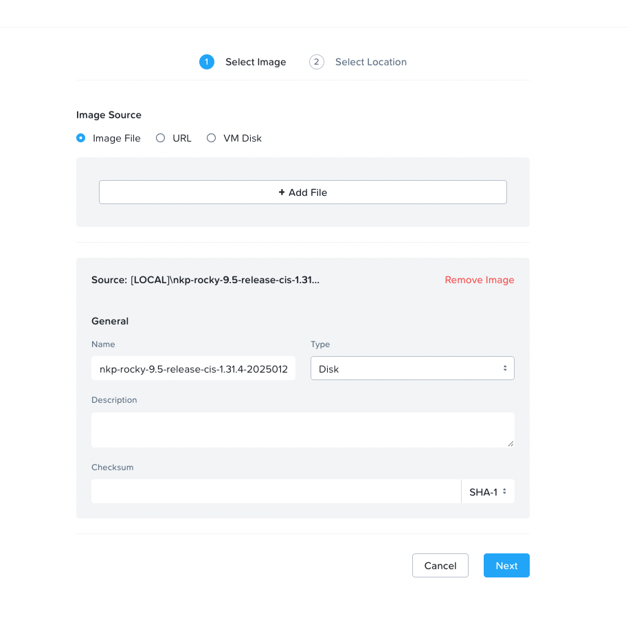

- For placement, choose **Place image directly on clusters** and select your cluster.

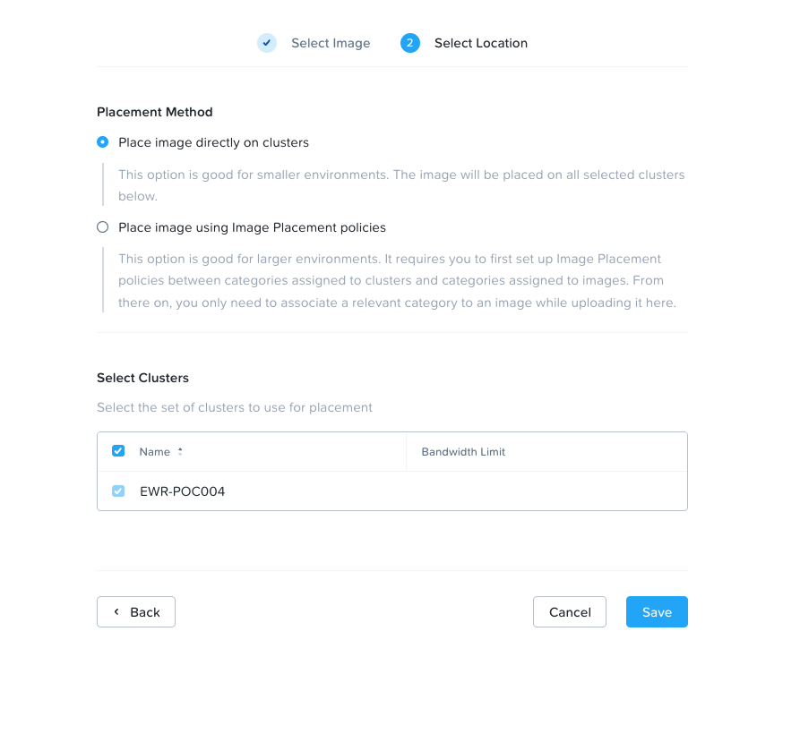

---

## Deploying an NKP Cluster

This section covers deploying a self-managed NKP cluster using the interactive `nkp` CLI. The interactive mode is convenient for lab/demo environments; for scripted, GitOps, or production use, supply all options as flags (see the example command below).

The default cluster topology is **3 control plane nodes + 4 worker nodes**.

### Example CLI Command (Non-Interactive / Scripted)


```sh
nkp create cluster nutanix \
  --cluster-name                              "${CLUSTER_NAME}" \
  --kubernetes-version                        "${KUBERNETES_VERSION}" \
  --endpoint                                  "${NUTANIX_PC_ENDPOINT}:9440" \
  --insecure                                  \
  --nutanix-username                          "${CAPX_USERNAME}" \
  --nutanix-password                          "${CAPX_PASSWORD}" \
  --control-plane-prism-element-cluster       "${NUTANIX_PE_CLUSTER}" \
  --control-plane-subnets                     "${NUTANIX_SUBNET}" \
  --control-plane-vm-image                    "${NODE_IMAGE_NAME}" \
  --control-plane-vcpus                       4 \
  --control-plane-cores-per-vcpu              1 \
  --control-plane-memory-gib                  16 \
  --control-plane-disk-gib                    100 \
  --control-plane-replicas                    3 \
  --control-plane-endpoint-ip                 "${CONTROL_PLANE_VIP}" \
  --worker-prism-element-cluster              "${NUTANIX_PE_CLUSTER}" \
  --worker-subnets                            "${NUTANIX_SUBNET}" \
  --worker-vm-image                           "${NODE_IMAGE_NAME}" \
  --worker-vcpus                              8 \
  --worker-cores-per-vcpu                     1 \
  --worker-memory-gib                         32 \
  --worker-disk-gib                           100 \
  --worker-replicas                           4 \
  --csi-username                              "${CSI_USERNAME}" \
  --csi-password                              "${CSI_PASSWORD}" \
  --csi-storage-container                     "${NUTANIX_STORAGE_CONTAINER}" \
  --csi-reclaim-policy                        "Retain" \
  --kubernetes-service-load-balancer-ip-range "${LB_IP_RANGE}" \
  --cni                                       "calico" \
  --ssh-public-key-file                       "${SSH_PUBLIC_KEY_FILE}" \
  --self-managed \
  --kubeconfig                                "${KUBECONFIG}"
```

> **Note on `--insecure`**: This is a boolean flag. Omit it entirely (the default) if your Prism Central endpoint has a valid, trusted TLS certificate. Include `--insecure` only if you need to skip TLS verification. Do **not** pass `--insecure false` — the flag's presence enables it regardless of value in most CLI frameworks.

For an exhaustive list of flags, run:
```sh
nkp create cluster nutanix --help
```
Or visit the [NKP CLI reference](https://docs.d2iq.com/dkp/2.8/nkp-create-cluster-nutanix).

---

### Interactive Deployment

In your terminal, run:
```sh
nkp create cluster nutanix
```

The interactive CLI will look like the following:

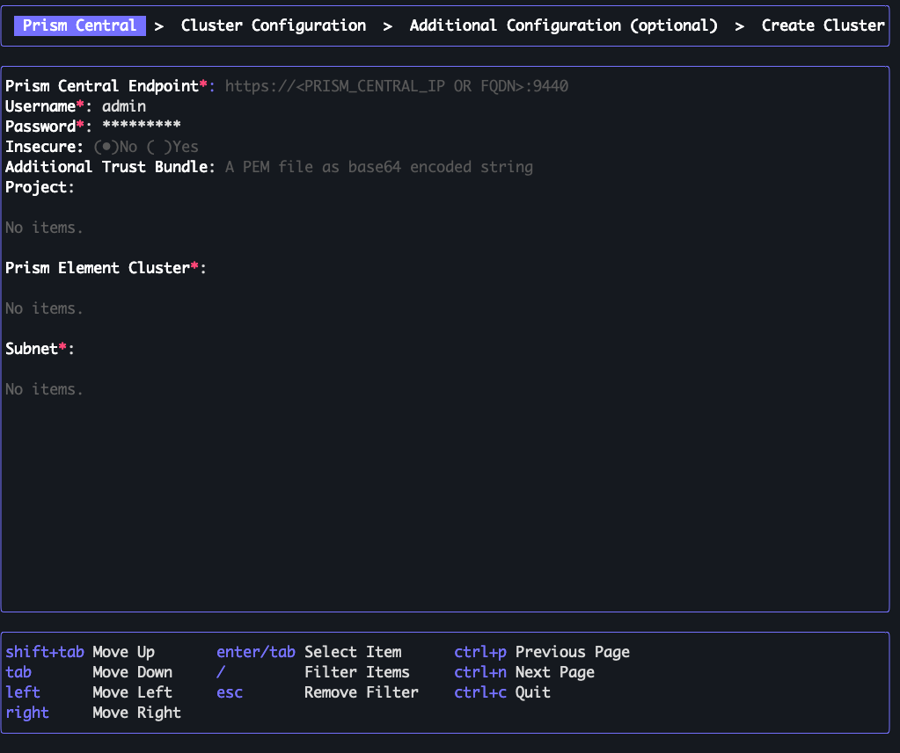

Use the on-screen key commands to navigate the tool. Fill in the fields as described below.

#### Connection Settings
| Field | Value |
|---|---|
| **Prism Central Endpoint** | IP or FQDN with port, e.g. `https://10.x.x.x:9440` |
| **Username** | Your Prism Central username (e.g. `admin`) |
| **Password** | Password for the above user |
| **Insecure** | Select `No` if your PC has a valid TLS certificate. Select `Yes` to skip certificate verification. |
| **Project** | Select from the fetched list. |
| **Prism Element Cluster** | Select from the fetched list. |
| **Subnet** | Select the subnet created earlier. |

#### Cluster Settings
| Field | Value |
|---|---|
| **Cluster Name** | A name of your choosing. |
| **Control Plane Endpoint IP** | Choose an unused IP address **outside** your DHCP/IPAM pool. To check usage: in Prism Element go to **Settings (⚙️) > Network Configuration**, click your subnet, then **Used IP Addresses**. |
| **VM Image** | The Rocky Linux 9.6 image uploaded earlier should appear in the list. |

#### Kubernetes Network Settings
| Field | Value |
|---|---|
| **Service Load Balancer IP Range** | A range in the format `x.x.x.x-y.y.y.y`. This must fall within your subnet and **outside** the DHCP/IPAM pool (same constraint as the Control Plane VIP). A single IP (e.g., `10.x.x.50-10.x.x.50`) is sufficient for a minimal lab. |
| **Pod Network** | Default `192.168.0.0/16` is fine unless it conflicts with your physical network. This is the internal pod overlay network — each pod gets a unique IP from this range regardless of which node it runs on. |
| **Service Network** | Default `10.96.0.0/12` is fine for most environments. Kubernetes Services (ClusterIP/VIP) are assigned from this range. |

#### Storage Settings
| Field | Value |
|---|---|
| **Reclaim Policy** | `Delete` for workload clusters (storage is cleaned up when PVCs are deleted). Use `Retain` for management clusters where platform data (Prometheus, Loki, Grafana) must survive accidental PVC deletions. |
| **File System** | `ext4` for general workloads. Use `xfs` for high-throughput sequential I/O workloads (e.g., Kafka). |
| **Hypervisor Attached Volumes** | Select `Yes` (required for AHV). |
| **Storage Container** | Select the storage container created earlier. |

#### Additional Configuration (Optional)
To avoid Docker Hub unauthenticated pull rate limits during bootstrap:
- **Registry URL**: `https://registry-1.docker.io`
- **Registry CA Certificate**: Leave blank.
- **Registry Username**: Your Docker Hub username.
- **Registry Password**: Your Docker Hub password or a personal access token (PAT recommended).

#### Create the Cluster
At the **Create NKP Cluster?** prompt, select `Create` and press Enter. The final configuration should look similar to:

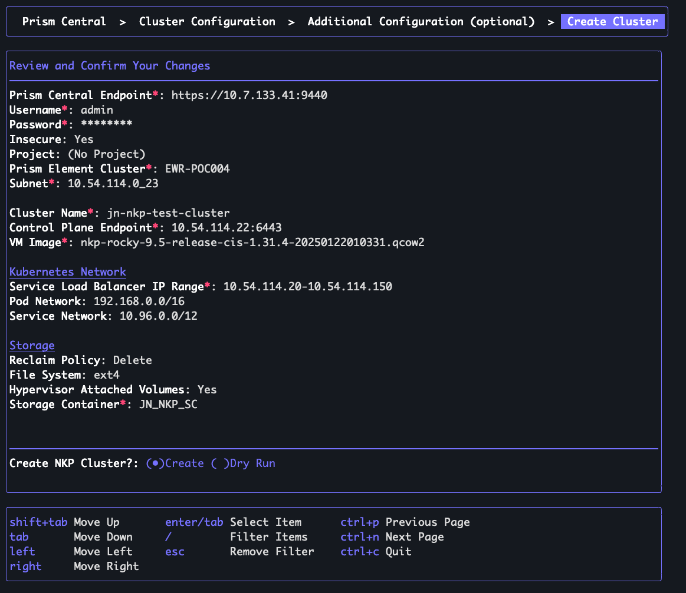

---

### Monitoring Cluster Creation

The `nkp` CLI will:
1. Spin up a **bootstrap KinD cluster** locally using your container runtime.
2. Use it to provision the **7 NKP VMs** on Nutanix (visible in Prism Central).
3. **Pivot** the cluster management to the newly created cluster.
4. Tear down the bootstrap cluster.
5. Write a kubeconfig file to your current working directory.

You can watch VM creation progress in Prism Central — you will initially see one bootstrap VM, then 7 cluster VMs (3 control plane + 4 worker).

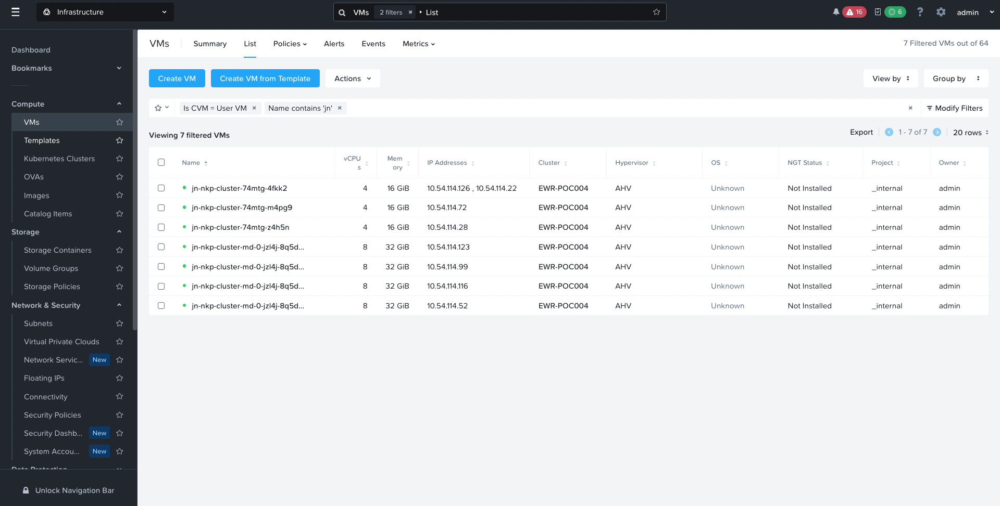

When the cluster is ready you will see a new kubeconfig file written to disk:

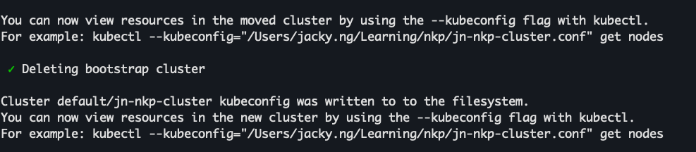

A successful deployment outputs:

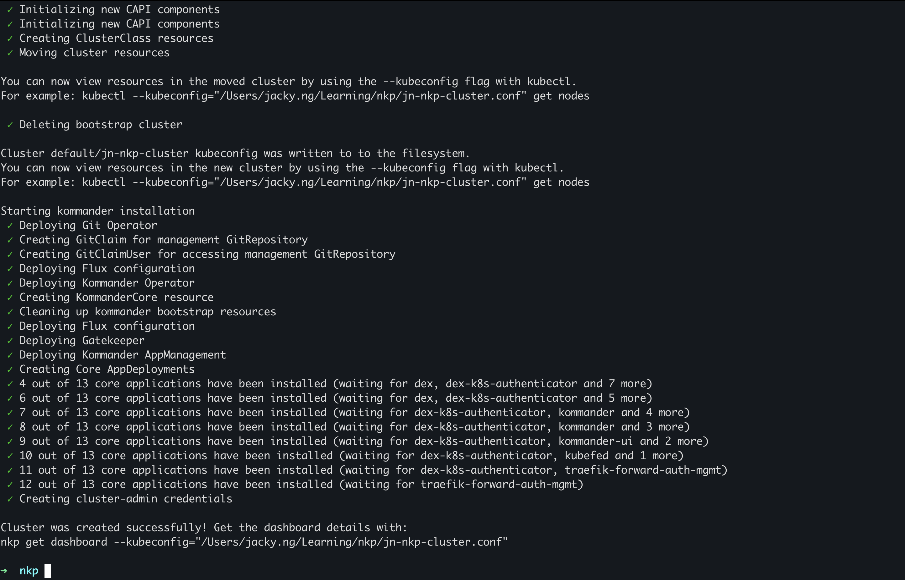

---

### Post-Deployment Steps

**Set your KUBECONFIG:**
```sh
export KUBECONFIG=${CLUSTER_NAME}-cluster.conf
```
> The kubeconfig is written to the current working directory unless `--output-directory` was specified. If you need to regenerate it later:
```sh
kubectl get secret ${CLUSTER_NAME}-kubeconfig -n default \
  -o jsonpath='{.data.value}' | base64 -d > ${CLUSTER_NAME}.conf
```

**Wait for Kommander to be fully ready:**
```sh
kubectl -n kommander wait --for condition=Ready helmreleases --all --timeout 15m
```

Expected output when ready:
```
helmrelease.helm.toolkit.fluxcd.io/cluster-observer-2360587938 condition met
helmrelease.helm.toolkit.fluxcd.io/dex condition met
helmrelease.helm.toolkit.fluxcd.io/dex-k8s-authenticator condition met
helmrelease.helm.toolkit.fluxcd.io/gatekeeper condition met
helmrelease.helm.toolkit.fluxcd.io/gatekeeper-proxy-mutations condition met
helmrelease.helm.toolkit.fluxcd.io/gateway-api-crds condition met
helmrelease.helm.toolkit.fluxcd.io/karma-traefik-certs condition met
helmrelease.helm.toolkit.fluxcd.io/kommander condition met
helmrelease.helm.toolkit.fluxcd.io/kommander-appmanagement condition met
helmrelease.helm.toolkit.fluxcd.io/kommander-operator condition met
helmrelease.helm.toolkit.fluxcd.io/kommander-ui condition met
helmrelease.helm.toolkit.fluxcd.io/kube-oidc-proxy condition met
helmrelease.helm.toolkit.fluxcd.io/kubefed condition met
helmrelease.helm.toolkit.fluxcd.io/prometheus-traefik-certs condition met
helmrelease.helm.toolkit.fluxcd.io/reloader condition met
helmrelease.helm.toolkit.fluxcd.io/traefik condition met
helmrelease.helm.toolkit.fluxcd.io/traefik-crds condition met
helmrelease.helm.toolkit.fluxcd.io/traefik-forward-auth-mgmt condition met
```

**Verify connectivity:**
```sh
kubectl get pods -A
kubectl get nodes
kubectl get kommandercluster -n kommander
```

**Access the dashboard:**
```sh
nkp open dashboard --kubeconfig=${CLUSTER_NAME}.conf
```
The login page will open in your browser. Credentials are printed to the shell. To retrieve them again later:
```sh
kubectl get secret dkp-credentials -n kommander \
  -o go-template='Username: {{.data.username|base64decode}}{{"\n"}}Password: {{.data.password|base64decode}}{{"\n"}}'
```

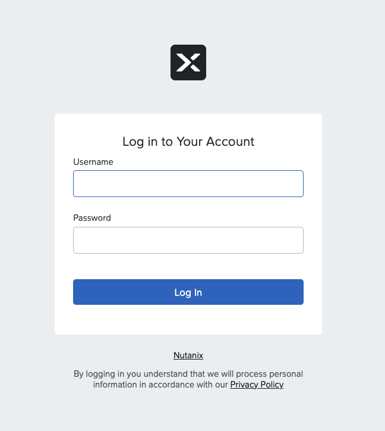

---

## (Optional) Adding Harbor Container Registry to the Cluster

NKP 2.17 adds native support for Harbor as an internal private registry. The prerequisites are:

- **CloudNativePG (CNPG) operator** installed via Helm, and the CNPG application enabled in the NKP console.
- An **S3-compatible object store** (e.g., Nutanix Objects, AWS S3, Rook Ceph). This guide uses Nutanix Objects.
- An **NKP Ultimate license**. Without it, the COSI Driver and Harbor application tiles in the NKP UI will not be available to enable.

---

### Deploying CloudNativePG

Add the Helm chart repository:
```sh
helm repo add cnpg https://cloudnative-pg.github.io/charts
helm repo update
```

Install the CNPG operator:
```sh
helm upgrade --install cnpg \
  --namespace cnpg-system \
  --create-namespace \
  cnpg/cloudnative-pg
```

Expected output:
```
Release "cnpg" does not exist. Installing it now.
NAME: cnpg
LAST DEPLOYED: ...
NAMESPACE: cnpg-system
STATUS: deployed
REVISION: 1
```

Verify operator resources:
```sh
kubectl get all -n cnpg-system
```

Deploy a CNPG database cluster (3-node PostgreSQL):
```sh
helm upgrade --install cnpg-database \
  --namespace database \
  --create-namespace \
  cnpg/cluster
```

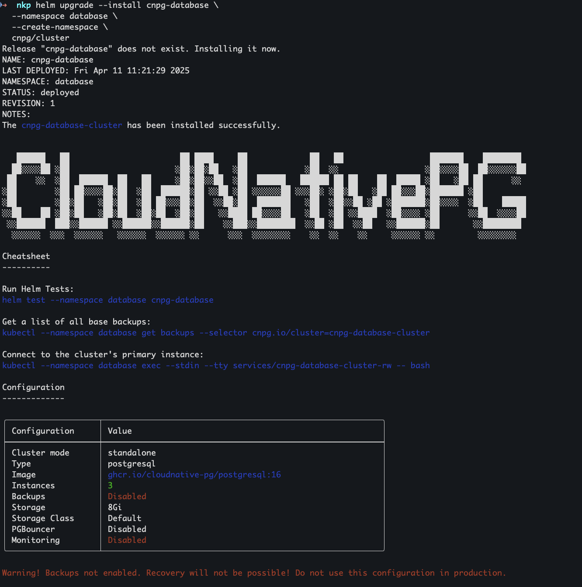

Watch pods come up (this takes a few minutes):
```sh
kubectl get pods -n database -w
```

When ready, all three pods should show `Running`:
```sh
NAME                      READY   STATUS    RESTARTS   AGE
cnpg-database-cluster-1   1/1     Running   0          4m22s
cnpg-database-cluster-2   1/1     Running   0          2m31s
cnpg-database-cluster-3   1/1     Running   0          65s
```

**Optional sanity check** — exec into the primary and test:
```sh
kubectl -n database exec --stdin --tty services/cnpg-database-cluster-rw -- bash
```
Within the container:
```sh
psql
# Inside psql:
\dt *.*
\q
```
Then exit the shell:
```sh
exit
```

---

### Adding Nutanix Object Store

1. In Prism Central, open the top-left drop-down and select **Objects** under **Unified Storage**.

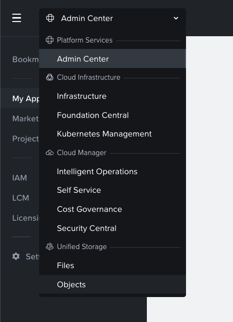

2. Click **Create Object Store**, then **Confirm** on the prerequisites window.

3. Fill in the following details:
    - **Object Store Name**: A descriptive, easily identifiable name.
    - **Domain**: Should auto-populate.
    - **Cluster**: Select the cluster to use.
    - **Worker Nodes**: Default is 3; for this lab scenario, `2` is sufficient.

4. Click **Next** and configure networking:
    - **Storage Network**: The subnet used by your CVMs.
    - **Object Store Internal IPs**: Two unused IP addresses in the CVM subnet.
    - **Public Network**: Your NKP subnet (or whichever subnet should have API access).
    - **Public Network Static IPs**: One IP address outside the IPAM pool and currently unused.

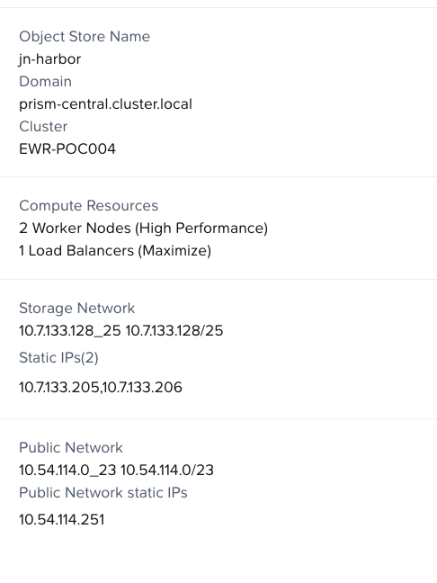

5. Wait for all validation checks to pass, then click **Create Object Store**.


6. Once the Object Store is ready, go to **Access Keys** > **Add People**, search for or add your user, and click **Generate Keys**.
7. Click **Download Key** and save the `.txt` file — it contains the **Secret Key**. The **Access Key** is also visible in the Objects UI. Keep both; you will need them for the COSI Driver configuration.

---

### Enabling CloudNativePG with your Cluster

> **Prerequisite**: An NKP Ultimate license is required. Apply it via the Nutanix Portal before proceeding.

1. In the NKP Web Console, click the top-left drop-down and select **Management Cluster Workspace**.

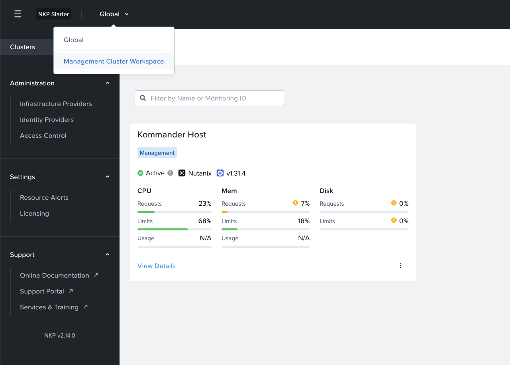

2. In the left menu, click **Applications**.
3. Filter by `CloudNativePG`, click the three-dot menu on the tile, and click **Enable** → **Enable**.

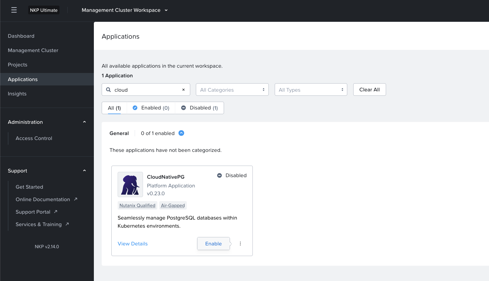

4. Return to the Application Dashboard. Filter by `COSI Driver` and click **Enable**.

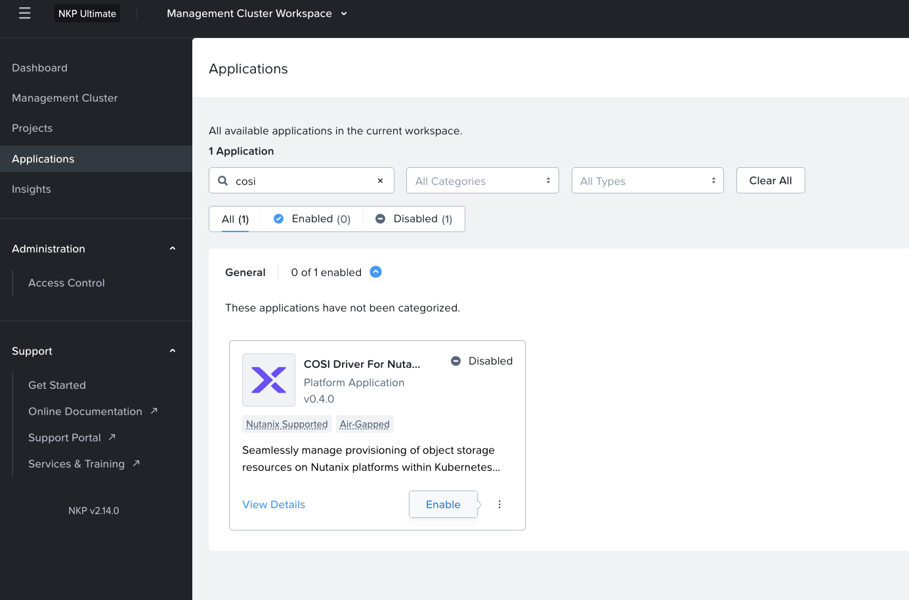

5. In the **Enable Workspace Platform Application** dialog, fill in:
    - **Prism Central Endpoint**: `https://<ip>:9440`
    - **Prism Central Username**: `admin`
    - **Prism Central Password**: Your admin password.
    - **Nutanix Object Storage Endpoint**: The Public IP of your Object Store.
    - **Nutanix Object Access Key**: From the downloaded key file.
    - **Nutanix Object Secret Key**: From the downloaded key file.

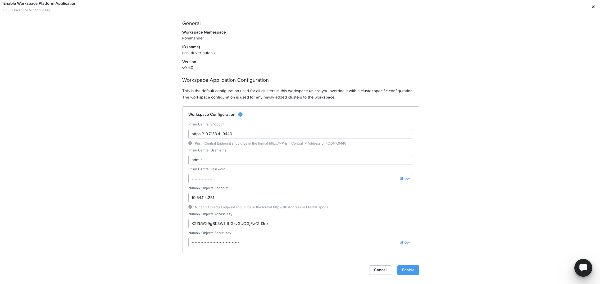

6. Click **Enable**.

7. Return to the Application Dashboard. Filter by `Harbor` and click **Enable**.

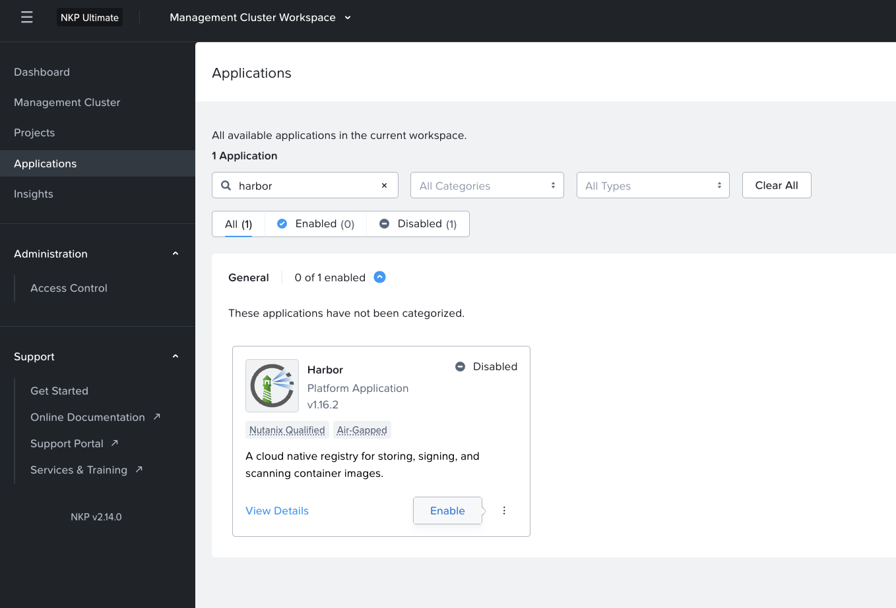

8. Under **S3 Object Store**, select `Nutanix Objects` from the drop-down.
   > If this option is greyed out, the COSI Driver for Nutanix was not correctly enabled. Revisit the previous step.

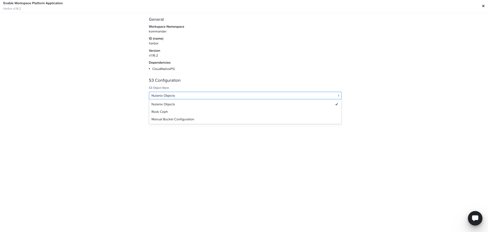

9. Click **Enable**.

> **Note**: Harbor and its dependencies are resource-intensive. If pods enter `Pending` state, your worker nodes may need more resources. In the NKP Console, go to **Management Cluster** > **Nodepools**, click the three-dot menu on the Worker nodepool, and increase vCPUs and memory (e.g., 16 vCPUs / 48 GiB). Prism Central will perform a rolling replacement of nodes — some services may be briefly unavailable during this process.

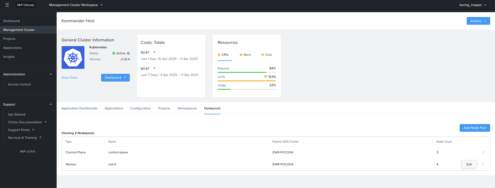
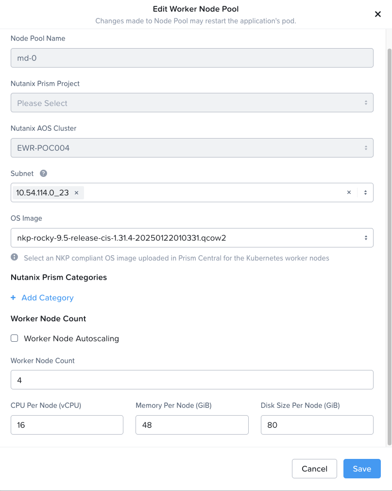

**Retrieve the Harbor URL:**
```sh
echo "https://$(kubectl -n kommander get kommandercluster host-cluster \
  -o jsonpath='{.status.ingress.address}'):5000"
```

**Retrieve the Harbor admin password:**
```sh
kubectl get secret -n ncr-system harbor-admin-password \
  -o jsonpath='{.data.HARBOR_ADMIN_PASSWORD}' | base64 -d
```
> Kubernetes secrets store values base64-encoded in the `data` field. The `base64 -d` decodes the value to plaintext. Log in to Harbor with username `admin` and this password.

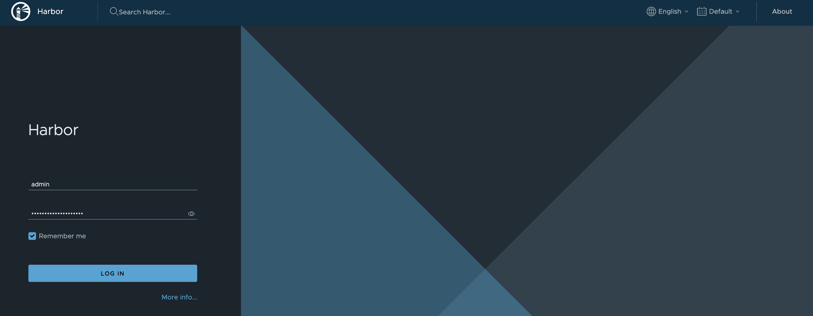

---

## Using Harbor as the Cluster's Pull-Through Cache

Without additional configuration, Harbor acts only as a standard image registry. Configuring it as a pull-through cache causes Harbor to proxy image pulls (e.g., from Docker Hub), cache them internally, and serve subsequent pulls locally — reducing latency and external bandwidth.

### Create a Registry Endpoint in Harbor

1. In the Harbor UI, go to **Administration** > **Users** > **NEW USER** and create a machine account for image pulling.
2. Go to **Administration** > **Registries** > **New Endpoint** and fill in:
    - **Provider**: `Docker Hub`
    - **Name**: A descriptive name (e.g., `dockerhub-proxy`)
    - **Endpoint URL**: `https://hub.docker.com` (auto-populated when Docker Hub is selected)
    - **Access ID**: Your Docker Hub username.
    - **Access Secret**: Your Docker Hub password or PAT.
    - **Verify Remote Cert**: Uncheck for lab environments.
3. Click **Test Connection** to validate, then **OK**.

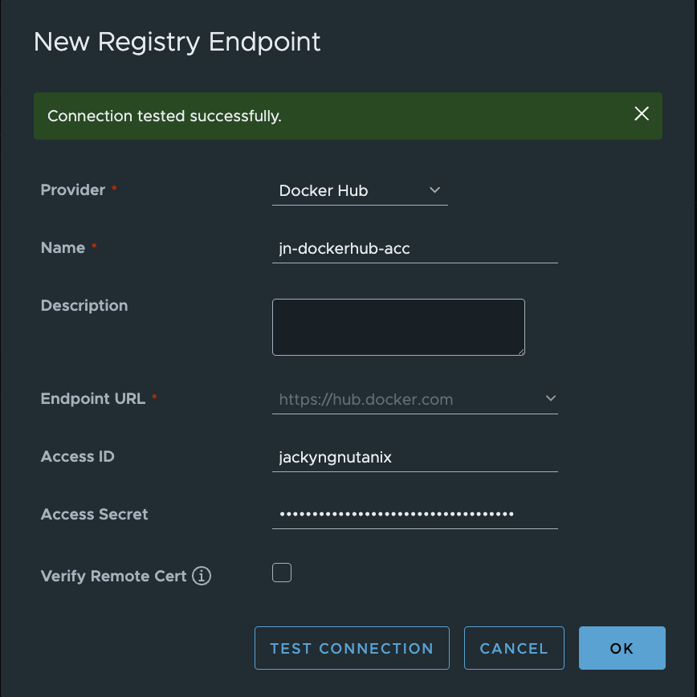

### Recreate the `library` Project as a Proxy Cache

1. Go to **Projects**, delete the default `library` project.

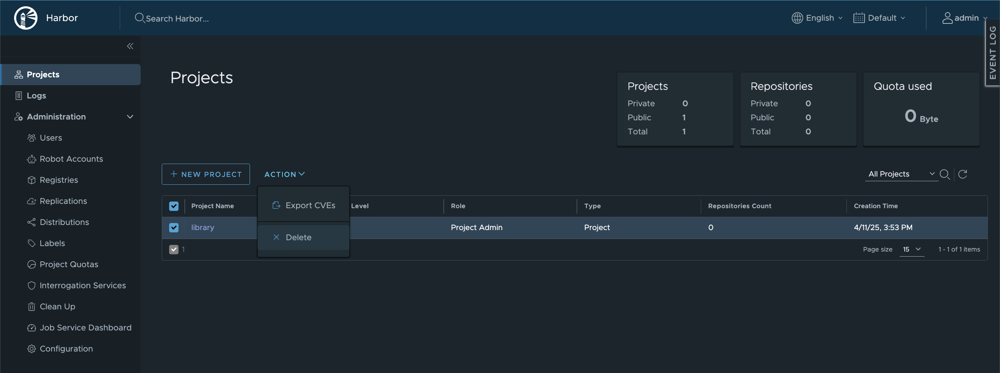

2. Click **NEW PROJECT** and fill in:
    - **Project Name**: `library`
    - **Access Level**: Unchecked (private)
    - **Project Quota Limits**: `-1` (unlimited)
    - **Proxy Cache**: Enable, select the Docker Hub registry endpoint created above.
    - **Bandwidth**: `-1`

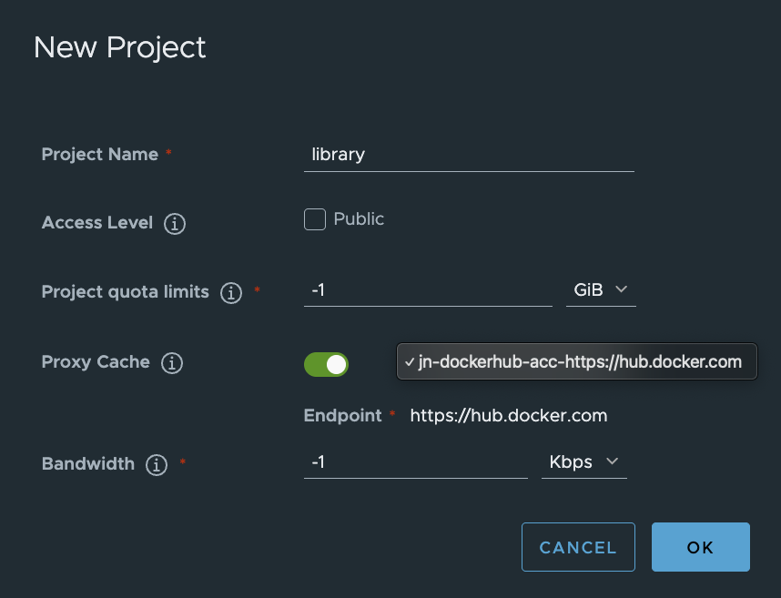

3. Click **OK**.

### Create a Robot Account

1. Click the `library` project > **Robot Accounts** > **NEW ROBOT ACCOUNT**.
2. Set the duration to **Never** (no expiry for lab use; apply an appropriate expiry for production).
3. On the **Permissions** screen, click **Select All** > **Finish**.
4. **Save the robot account name and secret** — this is the only time the secret is shown.

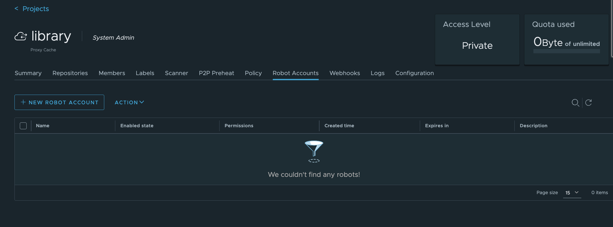

---

## Installing Kyverno for use with Harbor as a Pull-through Cache

Without automation, redirecting all pod image pulls through Harbor would require either manually editing every Pod/Deployment spec or updating `daemon.json` on every node. [Kyverno](https://kyverno.io/docs/introduction/how-kyverno-works/) allows you to enforce a policy that automatically rewrites Docker Hub image references to use Harbor instead.

**Install Kyverno:**
```sh
kubectl create -f https://github.com/kyverno/kyverno/releases/download/v1.13.0/install.yaml
```
Wait for all Kyverno resources to become ready:
```sh
kubectl wait --for=condition=Ready pods --all -n kyverno --timeout=5m
```

**Create the image rewrite policy:**

Create a file named `replace-image-registry-with-harbor.yaml`. Replace `<YOUR_HARBOR_URL>` with the Harbor URL retrieved earlier (e.g., `10.54.114.152:5000`) — **do not include `https://`** in the image reference; container image references use bare hostnames, not URIs.

```yaml
apiVersion: kyverno.io/v1
kind: ClusterPolicy
metadata:
  name: replace-image-registry-with-harbor
  annotations:
    policies.kyverno.io/title: Replace Image Registry With Harbor
    pod-policies.kyverno.io/autogen-controllers: none
    policies.kyverno.io/category: Sample
    policies.kyverno.io/severity: medium
    policies.kyverno.io/subject: Pod
    kyverno.io/kyverno-version: 1.11.4
    kyverno.io/kubernetes-version: "1.27"
    policies.kyverno.io/description: >-
      Rewrites Docker Hub image references to use Harbor as a pull-through cache.
      Kyverno intercepts Pod create/update events and mutates image fields to
      point to the Harbor proxy project instead of index.docker.io.
spec:
  rules:
    - name: redirect-docker
      match:
        any:
          - resources:
              kinds:
                - Pod
              operations:
                - CREATE
                - UPDATE
      mutate:
        foreach:
          - list: request.object.spec.initContainers[]
            context:
              - name: imageData
                imageRegistry:
                  reference: "{{ element.image }}"
            preconditions:
              any:
                - key: "{{imageData.registry}}"
                  operator: Equals
                  value: index.docker.io
            patchStrategicMerge:
              spec:
                initContainers:
                  - name: "{{ element.name }}"
                    image: <YOUR_HARBOR_URL>/library/{{imageData.repository}}:{{imageData.identifier}}
          - list: request.object.spec.containers[]
            context:
              - name: imageData
                imageRegistry:
                  reference: "{{ element.image }}"
            preconditions:
              any:
                - key: "{{imageData.registry}}"
                  operator: Equals
                  value: index.docker.io
            patchStrategicMerge:
              spec:
                containers:
                  - name: "{{ element.name }}"
                    image: <YOUR_HARBOR_URL>/library/{{imageData.repository}}:{{imageData.identifier}}
```

Apply the policy:
```sh
kubectl apply -f replace-image-registry-with-harbor.yaml
```

**Create the Harbor pull secret:**

> **Note**: The `--from-file=ca.crt=<(...)` syntax uses bash process substitution. This requires **bash** specifically — it will not work with `/bin/sh` or other shells.

```sh
export REGISTRY_USERNAME=<your-robot-account-name>
export REGISTRY_PASSWORD=<your-robot-account-secret>

kubectl create secret generic harbor-registry-credentials \
  --from-literal username="${REGISTRY_USERNAME}" \
  --from-literal password="${REGISTRY_PASSWORD}" \
  --from-file=ca.crt=<(kubectl -n kommander get kommandercluster host-cluster \
      -o jsonpath='{.status.ingress.caBundle}' | base64 -d)
```

**Update the Cluster resource to use Harbor:**
```sh
kubectl edit cluster <CLUSTER_NAME>
```

Navigate to `spec.topology.variables.imageRegistries` and update:
- `url`: Your Harbor URL appended with `/library` (e.g., `https://10.x.x.x:5000/library`)
- `imageRegistries.credentials.secretRef.name`: `harbor-registry-credentials`

Save and exit. This triggers a rolling node replacement — all nodes will be cycled one at a time to pick up the new registry configuration. Monitor progress:
```sh
kubectl get nodes -w
```

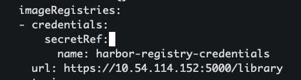

When all nodes are back to `Ready`:
```sh
NAME                                    STATUS   ROLES           AGE     VERSION
jn-nkp-cluster-md-0-mdt98-pwlfz-cvx7j   Ready    <none>          18m     v1.31.4
jn-nkp-cluster-md-0-mdt98-pwlfz-qht8k   Ready    <none>          10m     v1.31.4
jn-nkp-cluster-md-0-mdt98-pwlfz-tn9g2   Ready    <none>          12m     v1.31.4
jn-nkp-cluster-md-0-mdt98-pwlfz-vpbwl   Ready    <none>          8m10s   v1.31.4
jn-nkp-cluster-pmxmb-8kq7f              Ready    control-plane   14m     v1.31.4
jn-nkp-cluster-pmxmb-8r6cl              Ready    control-plane   18m     v1.31.4
jn-nkp-cluster-pmxmb-gvcgp              Ready    control-plane   9m54s   v1.31.4
```

**Test the pull-through cache:**
```sh
kubectl apply -f https://k8s.io/examples/controllers/nginx-deployment.yaml
kubectl get pods -w
```

Verify the image was served by Harbor by checking the Harbor UI under **Projects > library** — you should see the `nginx` image listed as a cached artifact.