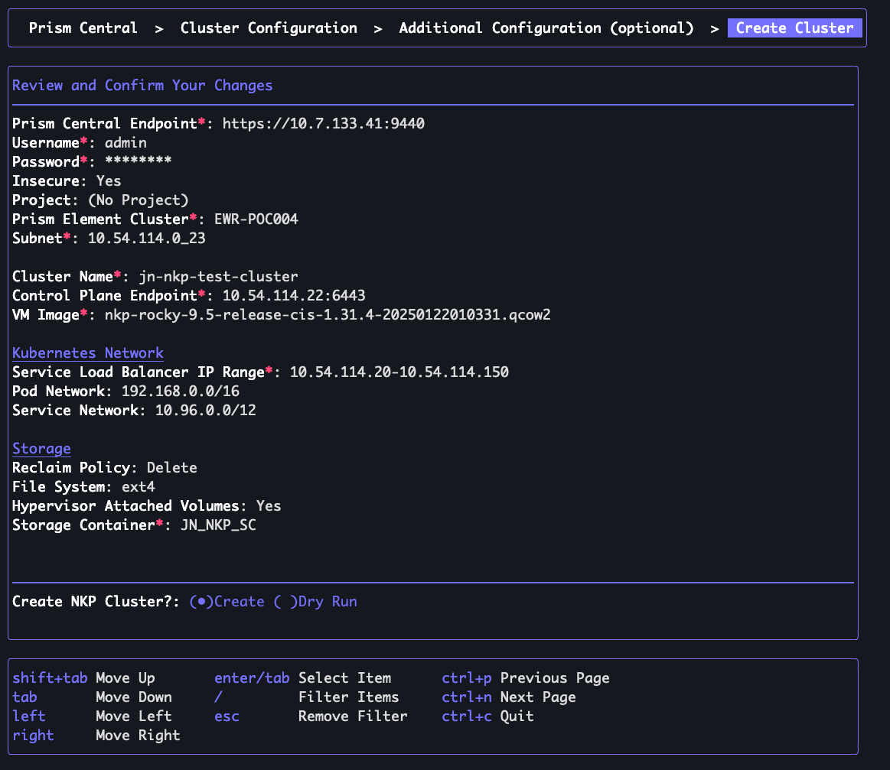

# Simple NKP Installation Guide on a Nutanix Cluster 

- This is a simple installation guide for Nutanix Kubernetes Platform v2.14 on simple AHV VMs and usiing a Linux/MacOS machine.

## Prerequisites
- Download the Nutanix Kubernetes Platform (NKP) CLI/binary and Konvoy Image Builder (KIB) from Nutanix Portal [here](https://portal.nutanix.com/page/downloads?product=nkp). Choose your appropriate OS and the version.
- A container engine of some kind i.e. Docker or Podman. Docker Desktop is usually not supported in some enterprises so you may need to use Podman.
- A container registry for your environment
- A valid Nutanix account
- A properly configured Prism Central with administrator access with the following credentials
    - Managing the cluster i.e. listing subnets, creating VMs in Prism Central
    - Managing persistent storage used by the Nutanix Container Storage Interface (CSI) provider.
    - Discovering node metadata used by Nutanix Cloud Cost Management (CCM) provider.
- A subnet with unused IP addresses (this example has 9 unused)
    - One IP address for each node in the Kubernetes cluster. 
    - Default cluster size has *three* control plane nodes and *four* worker nodes for a total of *seven*
    - *One* IP address for the control plane endpoint Virtual IP
    - *One* IP address for the NKP LoadBalancer serice Virtual IP
- Since we will be standing up a self-managed NKP cluster i.e. a cluster that isn't for managing another cluster you will need to unset your ``KUBECONFIG`` environment variable and make sure ``~/.kube/config`` doesn't exist. Copy the current config file to somewhere else for use later.

## Setting up a Subnet in Prism Central
- In Prism Central, under Infrastructure at the top drop down, select ``Network & Security``
- Then click ``Subnets``
- Click ``Create Subnet``
- Fill out the following:
    - Enter a name for the Subnet under ``Name``
    - For ``Type`` select VLAN
    - Select the appropriate ``Cluster``
    - Under ``IP Address Management`` and then ``IP Assignemnt Service`` select ``Nutanix IPAM``
    - Under ``Network IP Address / Prefix`` make sure that you give it a proper CIDR notation network address.
    - Under ``IP Pools`` provide a range from ``Start Address`` to ``End Address``. Make sure this range falls under IP addresses available in the subnet.
    - Provide a ``Gateway IP Address`` that adheres to the previously given Network IP Address
    - Click ``Create``

## Creating a Storage Container in Prism Central
- We will need a Storage Container for usage with NKP and the necessary storage drivers provisioning storage.
- In Prism Central under ``Infrastructure``, select ``Storage`` and then ``Storage Containers``.
- Fill in the details and advanced configuration settings as needed. In this scenario, we will leave everything default.


## Configuring Prism Central Authorization Policy and Role
- In Prism Central, go to ``Admin Center`` and click ``IAM``
- Click ``Identities`` and then ``Add Local User``. Fill it out with the appropriate details.
- Now go to ``Authorization Policies`` and click ``Create Authorization Policy``. Fill out the Policy and assign it the proper ``Role`` with the necessary credentials outlined [here](https://portal.nutanix.com/page/documents/details?targetId=Nutanix-Kubernetes-Platform-v2_14%3Atop-prism-central-role-permissions-r.html&a=9728ece46a91ccd8e14f9482b8693e927c28d3f08649b668180f06007cc059dbd062f5f7bdd998b8)


## Adding a Base Image for use with NKP
- In Prism Centraln we need to add an Image for use with the Nutanix Kubernetes Platform Image Builder (NIB) in order to create a custom image.
- In this example we will be assuming a NKP Starter License tier so we will need to use the pre-built image that was downloaded along with the NKP binary file.
- We will add a Rocky Linux 9.5 image that was downloaded from the portal [here](https://portal.nutanix.com/page/downloads?product=nkp&a=9728ece46a91ccd8e14f9482b8693e927c28d3f08649b668180f06007cc059dbd062f5f7bdd998b8)
- Under ``Infrastructure`` click the ``Compute`` drop-down and then ``Images``.
- Click ``Add Image`` and then add the Rocky Linux 9.5 image that was just downloaded.


- Choose a location for your image, for simplicity choose ``Place image directly on clusters``


## Creating a NKP Cluster
- This is going to perform a simple installation with a bit less customization option through the ``nkp`` cli tool.
- Export the following environment variables. Choose a cluster name of your choice and use your Prism Central credentials for `NUTANIX_USER` and `NUTANIX_PASSWORD`:
```sh
export CLUSTER_NAME=<name-of-nutanux-cluster>
export NUTANIX_USER=<username>
export NUTANIX_PASSWORD=<password>
```
- In your terminal/shell run the following command:
```sh
nkp create cluster nutanix
```
- The interactive CLI tool will look like the following:


- Using the CLI tool fill out the following instructions, following the key commands to navigate the tool.
- Fields to fill:
    - ``Prism Central Endpoint``: Use your Prism Central endpoint with IP or FQDN appended with :9440
    - ``Username``: Your Prism Central username i.e. admin
    - ``Password``: Your Prism Central password for previous username
    - ``Insecure``: Select ``No`` if you require a certificate to connect to PC. ``Yes`` if you do not. 
    - ``Project``: The NKP CLI tool will fetch a project to choose from.
    - ``Prism Element Cluster``: Select from a fetched list of Prism Element clusters.
    - ``Subnet``: Select from a fetched list of subnets. Select the one we created earlier in the [Setting up a Subnet in Prism Central](#setting-up--subnet-in-prism-central) section.
    - ``Cluster Name``: If you exported the ``CLUSTER_NAME`` env variable earlier it will be populated here. Otherwise you can fill it in now.
    - ``Control Plane Endpoint``: Choose an unused IP address from your created ``Subnet``. If you do not know which ones are currently used go to Prism Central > ``Infrastructure`` > `` Network & Security`` > ``Subnets`` > ``Network Config`` button. Now next to your created subnet click on ``Used IP Addresses`` and you will see the currently used IP Addresses in this subnet. Pick an IP address not present here and one that does not fall under the IPAM range as well in the ``Service Load Balancer IP Range`` a bit further.
    - ``VM Image``: A fetched list of *compatible* VM images should show up i.e. the Rocky Linux image we uploaded.

- Now under the ``Kubernetes Network`` section:
    - ``Service Load Balancer IP Range``: Supply a range for the Load Balancer IP in a range of the format ``x.x.x.x-y.y.y.y``. Make sure that this range falls under your subnet.
    - ``Pod Network``: Can be left as default i.e. ``192.168.0.0/16``. This is the IP internally to the Kubernetes cluster isolated by Pod. You can think of this as the Pod having it's own network and the internal containers within each Pod having each their own unique IP address. So container A within Pod A can have an IP address of say ``192.168.0.3`` as well as Container B within Pod B with the same IP Address.
    - ``Service Network``: Can be left as default i.e. ``10.96.0.0/12``. Created services within the Kubernetes service will have a VIP or ClusterIP in this address range.

- Under the ``Storage`` section:
    - ``Reclaim Policy``: The behavior in which when a user deletes a Persistent Volume Claim (PVC) whether the Kubernetes cluster will ``Retain`` or ``Delete`` the associated Persistent Volume (PV) dynamically created by a Storage Class (SC). If your application might have sensitive or important data you may use Retain. For this example we will use ``Delete``.
    - ``File System``:  For a simple usecase here, choose ``ext4`` for general use as XFS is typically better with large files.
    - ``Hypervisor Attached Volumes``: Select ``Yes``.
    - ``Storage Container``: Select the name of your created Storage Container from the section [Creating a Storage Container in Prism Central](#creating-a-storage-container-in-prism-central) that is fetched.

- We are now at the ``Additional Configuration (optional)`` section. Here you can fill in the details as necessary for use within the cluster, we will mostly use defaults here besides the following:
    - The kubelet on the Kubernetes cluster may fail to pull images due to an un-authenticated pull rate limit. To overcome that you should provide DockerHub credentials. A personal/free account should be enough.
    - Under the ``Registry`` section:
        - For ``Registry URL`` use ``https://registry-1.docker.io``
        - Leave ``Registry CA Certificate`` blank
        - For ``Registry Username`` type in your DockerHub username
        - For ``Registry Password`` you can either use your DockerHub password or a generated personal access token which is advised.

- Finally during the ``Create NKP Cluster?:`` prompt, we will select ``Create`` and hit Enter. The final config will look similar to the following image:



- We will now wait for the NKP CLI to create a bootstrap cluster which will then create the actual NKP cluster.
    - If you want to follow progress of creation of some resources via Prism Central UI you will initially see one VM for the bootstrap node and then 7 nodes in total for the self-managed standup (3 control plane nodes and 4 worker nodes).

    

- Eventually when the cluster infrastructure, control-plane, machines, CAPI components, ClusterClass resources are ready, NKP will destroy the bootstrap cluster and create a kubeconfig file. 


- When the cluster successfully deploys you should see the following messages.


- You may need to wait for Kommander to fully be ready and you can watch that with the following command:
```sh
kubectl -n kommander wait --for condition=Ready helmreleases --all --timeout 15m
```

- The logs will look like the following when ready:
```
helmrelease.helm.toolkit.fluxcd.io/cluster-observer-2360587938 condition met
helmrelease.helm.toolkit.fluxcd.io/dex condition met
helmrelease.helm.toolkit.fluxcd.io/dex-k8s-authenticator condition met
helmrelease.helm.toolkit.fluxcd.io/gatekeeper condition met
helmrelease.helm.toolkit.fluxcd.io/gatekeeper-proxy-mutations condition met
helmrelease.helm.toolkit.fluxcd.io/gateway-api-crds condition met
helmrelease.helm.toolkit.fluxcd.io/karma-traefik-certs condition met
helmrelease.helm.toolkit.fluxcd.io/kommander condition met
helmrelease.helm.toolkit.fluxcd.io/kommander-appmanagement condition met
helmrelease.helm.toolkit.fluxcd.io/kommander-operator condition met
helmrelease.helm.toolkit.fluxcd.io/kommander-ui condition met
helmrelease.helm.toolkit.fluxcd.io/kube-oidc-proxy condition met
helmrelease.helm.toolkit.fluxcd.io/kubefed condition met
helmrelease.helm.toolkit.fluxcd.io/prometheus-traefik-certs condition met
helmrelease.helm.toolkit.fluxcd.io/reloader condition met
helmrelease.helm.toolkit.fluxcd.io/traefik condition met
helmrelease.helm.toolkit.fluxcd.io/traefik-crds condition met
helmrelease.helm.toolkit.fluxcd.io/traefik-forward-auth-mgmt condition met
```

- You can run a few ``kubectl`` commands to test connectivity such as:
```sh
kubectl get pods
kubectl get nodes
kubectl get kommander -n kommander
```
- If the above commands don't work and you a connectivity/API server connection error you will need to set your ``KUBECONFIG`` env variable to the newly created ``$CLUSTER_NAME-cluster.conf`` file in the current working directory.
```sh
export KUBECONFIG=$CLUSTER_NAME-cluster.conf
```


- Now to test the web GUI url use the following command:
```sh
nkp open dashboard --kubeconfig=${CLUSTER_NAME}.conf
```
- Once that command is entered, the login page should automatically open in your browser with the following credentials displayed in shell:
```sh
Username: <generated-username>
Password: <generated-password>
URL: https://<ip-address>/dkp/kommander/dashboard
```


## Adding Harbor Container Registry to the Cluster
- By default NKP clusters do not have their own dedicated internal private registry. NKP with 2.14 now supports Harbor for their internal registry. The following are steps to deploy it into your NKP cluster.
- Prerequisites:
    - Deploy the Cloud Native Postgres (CloudNativePG) operator and then enabling the CloudNativePG application on the cluster. We will be deploying the CNPG operator through ``Helm`` as it is a good tool to have and use.
    - Having access to an S3-compatible object store such as ``Nutanix Objects``, ``AWS S3``, or an integrated ``Rook Ceph``. For this scenario we will be using ``Nutanix Objects``.

### Deploying CloudNativePG
- We will now deploy the CNPG operator via Helm chart. The Helm charts are [here](https://github.com/cloudnative-pg/charts). Run the following command to add the Helm chart into your internal repo:
```sh
helm repo add cnpg https://cloudnative-pg.github.io/charts
```

- The following command wll install the operator:
```sh
helm upgrade --install cnpg \
  --namespace cnpg-system \
  --create-namespace \
  cnpg/cloudnative-pg
```

- You will see the following:
```
Release "cnpg" does not exist. Installing it now.
NAME: cnpg
LAST DEPLOYED: Fri Apr 11 11:13:51 2025
NAMESPACE: cnpg-system
STATUS: deployed
REVISION: 1
TEST SUITE: None
NOTES:
CloudNativePG operator should be installed in namespace "cnpg-system".
You can now create a PostgreSQL cluster with 3 nodes as follows:

cat <<EOF | kubectl apply -f -
# Example of PostgreSQL cluster
apiVersion: postgresql.cnpg.io/v1
kind: Cluster
metadata:
  name: cluster-example

spec:
  instances: 3
  storage:
    size: 1Gi
EOF

kubectl get -A cluster
```

- You can verify the resources that get created with the operator in the ``cnpg-system`` namespace via:
```sh
kubectl get all -n cnpg-system
```

- Next we'll deploy an actual CNPG database cluster:
```sh
helm upgrade --install cnpg-database \
  --namespace database \
  --create-namespace \
  cnpg/cluster
```

- You will then see the following:


- You can see the created resources in the ``database`` namespace via:
```sh
kubectl get all -n database
```

- It will take awhile for everything to spin up and reconcile but you can watch the progression of the CNPG database cluster pods with the following command:
```sh
kubectl get pods -n database -w
```

- When everything is finished you should see three `Running` pods:
```sh
kubectl get pods -n database
```
- The output:
```sh
NAME                      READY   STATUS    RESTARTS   AGE
cnpg-database-cluster-1   1/1     Running   0          4m22s
cnpg-database-cluster-2   1/1     Running   0          2m31s
cnpg-database-cluster-3   1/1     Running   0          65s
```

- For a sanity test on the database pods, exec into the exposed service:
```sh
kubectl -n databasase exec --stdin --tty services/cnpg-database-cluster-rw -- bash
```

- Within `bash` on the container run `psql:
```sh
postgres@cnpg-database-cluster-1:/$ psql
psql (16.8 (Debian 16.8-1.pgdg110+1))
Type "help" for help.
```

- And you can then test with a command like the following to see system tables:
```psql
\dt *.*
```

- Now quit the psql CLI
```
\q
```

- Exit the exec
```sh
exit
```

### Adding Nutanix Object Store
- Navigate to `Prism Central` and in the top-left drop-down menu select `Objects` under `Unified Storage`


- Click the `Create Object Store` button and then `Confirm` on the `Create Object Stores: Prerequisites window.

- In the following window supply the following details:
    - `Object Store Name`: Give it a name that is easily identifiable
    - `Domain`: It should automatically pull the domain name
    - `Cluster`: Select the cluster to use
    - `Worker Nodes`: By default, it's set to 3 but for this scenario we'll use `2` Worker Nodes.
- Click `Next` and configure the following:
    - `Storage Network`: Select your subnet where your CVMs ideally use IP addresses from
    - `Object Store Internal IPs`: Provide two IP addressess that exist in the same subnet as your CVM and not being currently used
    - `Public Network`: Select your subnet, can be similar to the one used for NKP cluster creation
    - `Public Network Static IPs`: Select an IP address outside of the IPAM pool and unused.

- The following is an example of final configuration:


- Wait for the Object Store validation checks to all pass. You will be unable to create your Object Store until that happens. Hit `Create Object Store` when the checks have all been validated.

- Wait for `Nutanix Objects` to finish creating your Object store


- In `Objects` go to `Access Keys` and click `Add People` to generate access keys for API usage.
- Search for people or Add people not in a directory service. Lastly, generate the keys.
- Click `Download Key` and save it to your local machine. The txt file will have the `Secret Key`. You will only be able to see the `Access Key` within the Objects UI. We will need both keys later for the `COSI Driver for Nutanix` application.


### Enabling CloudNativePG with your Cluster
- Ensure that you have NKP Ultimate license. If you do not go to the Nutanix Portal and request a NKP Ultimate license key and apply it to your NKP cluster.

- In your NKP Web console in the top left click the drop down menu that says Global and select `Management Cluster Workspace`


- On the left side of the menu click ``Applications``
- Then filter the name for `CloudNativePG`.
- Click the three dots on the `CloudNativePG` tile and click `Enable` and then `Enable` again.


- Next go back to the `Application Dashboard` and filter name by `COSI Driver` and click `Enable`


- In `Enable Workspace Platform Application` box, fill out the following details:
    - `Prism Central Endpoint`: Your Prism Central URL likely in the form of `https://<ip>:9440`
    - `Prism Central Username`: Your Prism Central administrator username i.e. `admin`
    - `Prism Central Password`: Your Prism Central administrator password
    - `Nutanix Object Storage Endpoint`: The Public IP of your Object Store.
    - `Nutanix Object Access Key`: Generated in the previous section
    - `Nutanix Object Secret Key`: Generated in the previous section. In the downloaded `.txt` file.


- Click `Enable`


- Again, go back to the `Application Dashboard` and filter name by `Harbor`. Do the same as CPNG and Enable it.


- Under `S3 Object Store` click the drop-down and select `Nutanix Objects`. If you did not properly setup the `COSI Driver for Nutanix` application, this option will be greyed out.


- Click `Enable` to enable `Harbor`.

- **NOTE**: You may need to enable more resources for your compute/worker nodes. You can do so by going to `Management Cluster` under your `Management Cluster Workspace` and then clicking `Nodepools`. 

- Click the three dots for the `Worker` node with a `Node Count` of 4.


- Bump up the resources as you see fit. In this example, I used 16 `vCPUs` and 48gb `Memory`.

- Click `Save` and wait for Prism Central to finish provisioning. Prism Central will provision new VMs one by one and then condemn the old VMs. Some functions may go down/not be accessible intermittently in the NKP cluster.

- Run the following to find the address of the Harbor container registry:
```sh
echo "https://$(kubectl -n kommander get kommandercluster host-cluster -o jsonpath='{.status.ingress.address}'):5000"
```

- Now to grab the password of Harbor:
```sh
kubectl get secrets -n ncr-system harbor-admin-password -o jsonpath='{.data.HARBOR_ADMIN_PASSWORD}' | base64 -d
```

- What the above command does is data is converted to base64 encoding when placed in the `data` field of a Kubernetes secret. It will be plain text if placed in `stringData`. The output will look something like: 
```
?YmxhaCBibGFoCg==
```

- Enter the Harbor Registry URL and input the following values:
    - `Username`: `admin`
    - `Password`: The output of the base64 decoded password above.


## Adding Okta as Identity Provider to the Cluster

## Troubleshooting Errors


